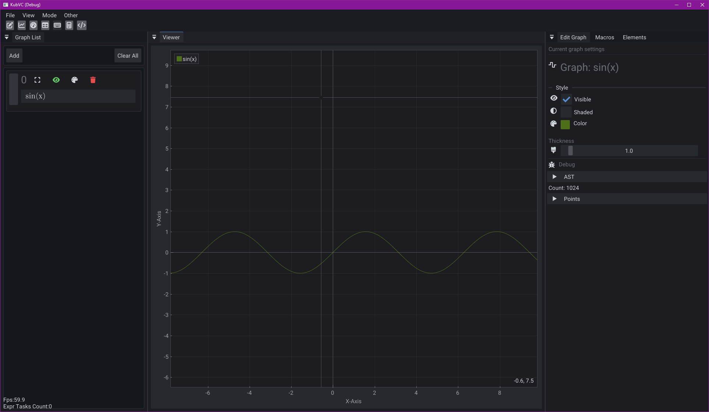
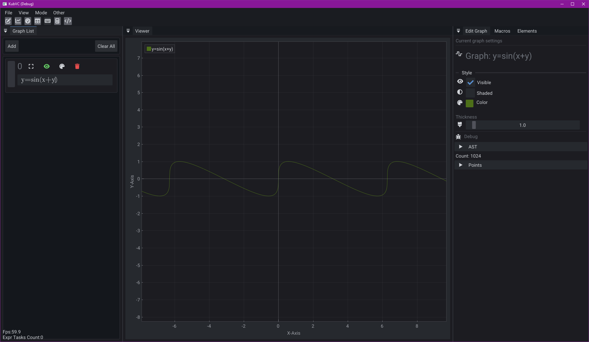
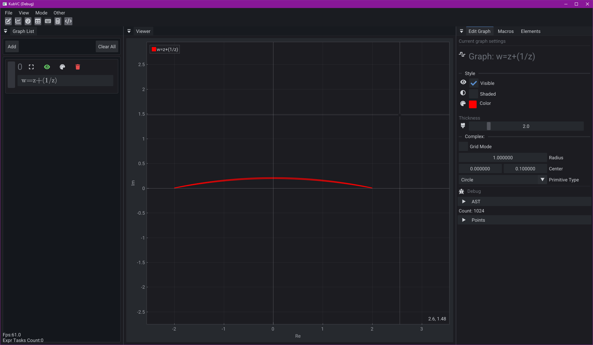
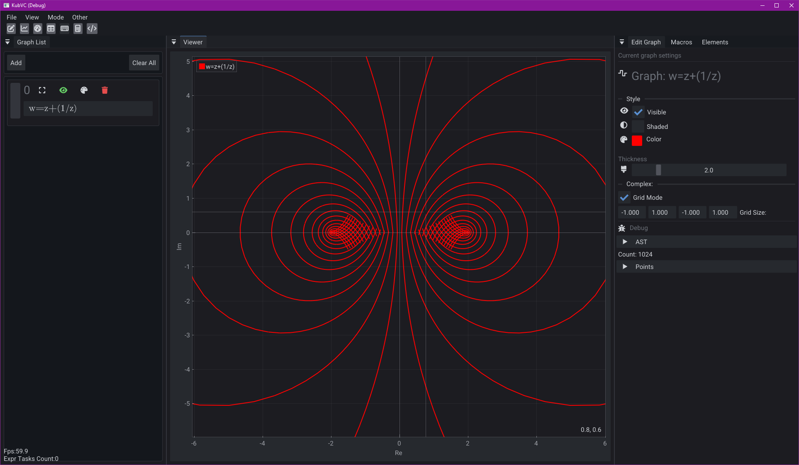
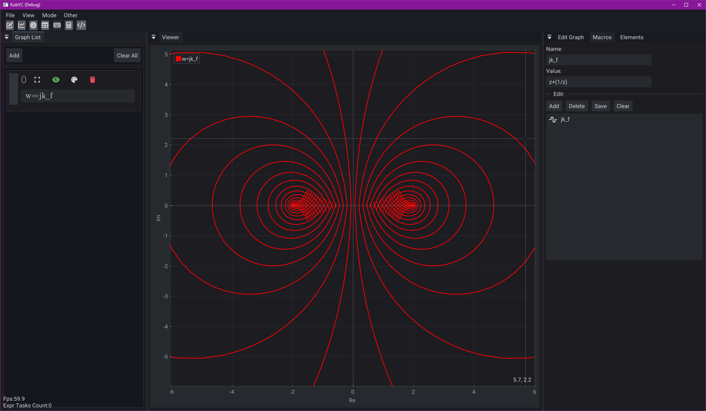
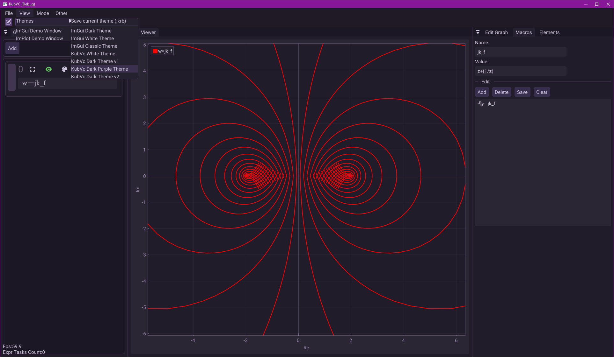
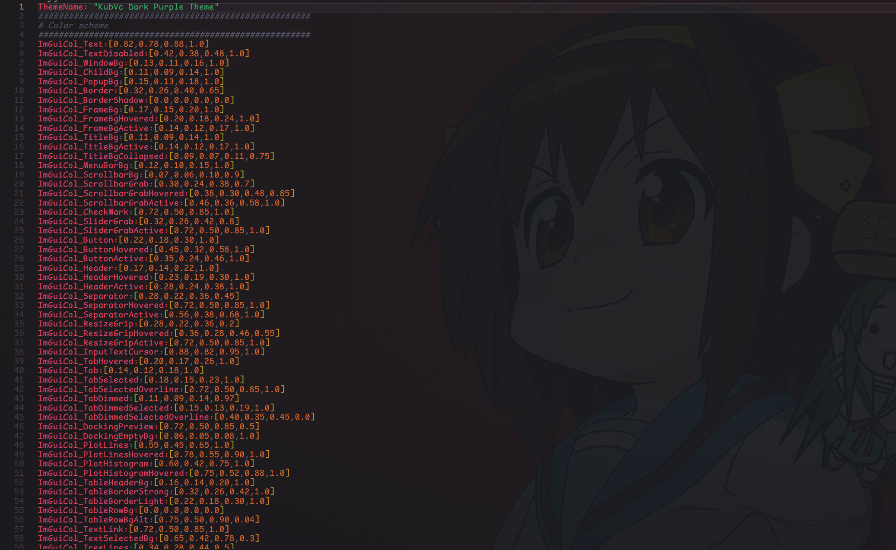

# KubVC
KubVC is a graphing calculator built in modern C++. It combines real and complex evaluation modes, both capable of real-time evaluation. It also supports macros, themes, parameters and projects.



## Table of Contents

- [Build & Run](#build-&-run)
- [Features](#features)
- [Project status](#project-status)

# Build & Run

## Prerequisites

- CMake 3.20+
- C++ 20 MSVC or GCC
- OpenGL
- Wayland
- X11

## Windows

```cmd
mkdir build
cd build
cmake ..
cmake --build --preset debug-gcc
bin\Release\KubVcApp.exe
```

## Linux

```bash
mkdir build && cd build
cmake ..
cmake --build --preset debug-gcc
cd bin && ./KubVcApp
```

# Features

## Real and Complex modes
## Example 1

Real mode handles everything from basic functions to advanced implicit equations, such as `y = sin(x + y)`.



## Example 2

Complex mode is designed for evaluating conformal maps. It can map onto a circle, rectangle, or rect — for example, the Joukowsky transform.

- Circle



- Grid




## Macros

Macros are a simple tool that can replace a codeword with some expression.



## Themes

KubVC supports custom themes. It uses the [korobok](https://github.com/Aty-0/korobok) format for opening and saving themes.

- Change theme



- Theme file structure



You can also use the default ImGui themes, edit them via the ImGui demo window, and then save them. 

## Parameters

todo

# Project status

KubVC is currently in alpha, so expect bugs, unfinished features, and performance issues.